  

  

  Building thoughtful software with Python, AI tools, desktop apps, and clean interfaces.

  
  

## Focus

- AI-assisted desktop experiences
- Python, Qt, automation, and product tooling
- Interfaces that feel useful, calm, and alive

## Featured Work

| Project | What it does | Stack |
| --- | --- | --- |
| `Project One` | A short sentence about your most important project. | Python / Qt / AI |
| `Project Two` | A short sentence about another project worth showing. | TypeScript / React |
| `Project Three` | A useful tool, experiment, or research project. | Python / Automation |

## Toolkit

  
  
  
  
  

## Snapshot

  

